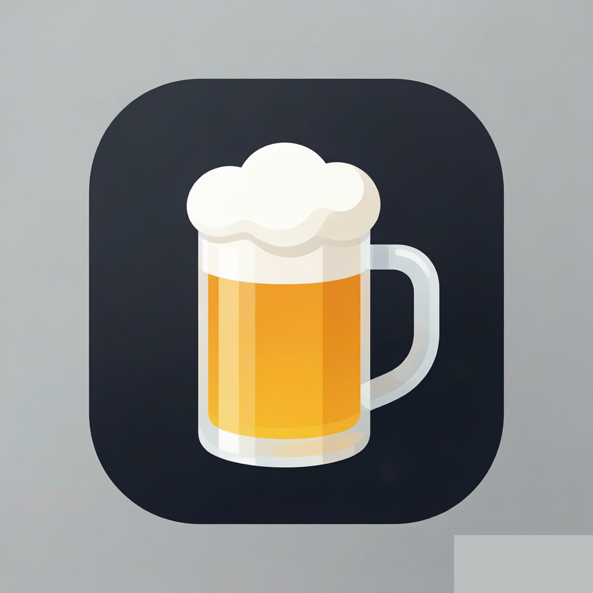

# 🍺 BrewMaster — Homebrew 交互式管理工具
一个基于 Flask + Web 前端的 Homebrew 图形化管理工具，提供可视化的包搜索、安装、升级、卸载、服务管理、Brewfile 导入导出等功能。支持打包为原生 macOS `.app` 应用。



---

## ✨ 功能特性

| 功能 | 说明 |
|------|------|
| 📊 仪表盘 | 一览已安装包数量、过期包、服务状态、缓存大小 |
| 🔍 包搜索 | 关键字搜索 Formulae 和 Casks，支持安装推荐 |
| 📦 包管理 | 安装 / 升级 / 卸载，实时终端输出 |
| 🔄 可用更新 | 启动时自动 `brew update`，Formulae 与 Casks 分两栏显示 |
| ⚙️ 服务管理 | 启动 / 停止 / 重启 brew services |
| 🧹 缓存清理 | 一键 `brew cleanup` 释放磁盘 |
| 📝 Brewfile | 导出 / 预览 / 批量安装 Brewfile |
| 📜 操作历史 | 记录所有操作便于回溯 |
| 🔐 Sudo 支持 | 升级 Cask 等需要密码时弹出 macOS 原生密码框 |
| ⏹ 关闭服务 | 前端一键关闭后台进程 |

---

## 📋 环境要求

- **macOS** 11.0 (Big Sur) 或更高
- **Homebrew** 已安装（`/opt/homebrew/bin/brew` 或 `/usr/local/bin/brew`）
- **Python** 3.9+（系统自带即可）
- **Flask** 3.0+（`run.sh` 会自动安装）

---

## 🚀 快速开始

### 方式一：脚本启动（开发模式）

```bash
git clone https://github.com/NatsuF/brew-gui.git
cd brew-gui
chmod +x run.sh
./run.sh
```

`run.sh` 会自动：
1. 检测并创建 `.venv` 虚拟环境
2. 安装 Flask 依赖
3. 启动服务并自动打开浏览器 `http://localhost:5432`

按 `Ctrl+C` 停止服务。

### 方式二：手动启动

```bash
git clone https://github.com/NatsuF/brew-gui.git
cd brew-gui

# 创建虚拟环境并安装依赖
python3 -m venv .venv
.venv/bin/pip install -r requirements.txt

# 启动服务
.venv/bin/python3 app.py
```

然后在浏览器打开 `http://localhost:5432`。

---

## 📦 打包为 macOS 应用

使用 PyInstaller 打包为原生 `.app`（无需终端、无程序坞图标跳动）。

### 前提

```bash
pip3 install pyinstaller
```

### 打包命令

```bash
pyinstaller brewmaster.spec --noconfirm
```

产物在 `dist/BrewMaster.app`，双击即可运行。

### 打包内容

`brewmaster.spec` 已配置：

- 打包 `templates/`、`static/`、`sudo_askpass.sh` 到 app bundle
- 使用 `assets/BrewMaster.icns` 作为应用图标
- `console=False`（无终端窗口）
- `LSUIElement=True`（不在程序坞显示图标）

---

## 🗂 项目结构

```
brew-gui/
├── app.py                 # Flask 后端主程序
├── brewmaster.spec        # PyInstaller 打包配置
├── requirements.txt       # Python 依赖
├── run.sh                 # 一键启动脚本
├── sudo_askpass.sh        # SUDO_ASKPASS 密码弹窗 helper
├── assets/
│   ├── BrewMaster.icns    # macOS 应用图标
│   └── icon_1024.png      # 图标源文件
├── templates/
│   └── index.html         # 单页前端页面
└── static/
    ├── css/style.css      # 样式
    └── js/app.js          # 前端逻辑
```

---

## 🔧 配置说明

### 端口

默认端口 `5432`，在 `app.py` 末尾修改：

```python
app.run(host="127.0.0.1", port=5432)
```

### Sudo 密码支持

升级 Cask 等操作需要管理员权限时，`sudo_askpass.sh` 会通过 `osascript` 弹出 macOS 原生密码输入框。`app.py` 中的 `_find_askpass_helper()` 会自动定位该脚本，兼容开发环境和打包后的 `.app`。

### 看门狗

服务内置 30 秒无活动自动关闭的看门狗（用于打包版节省资源）。在前端任意操作会重置计时。

---

## 📖 使用说明

1. **启动**：双击 `BrewMaster.app` 或运行 `./run.sh`
2. **仪表盘**：首页展示 Homebrew 整体状态
3. **搜索安装**：在「搜索」页输入包名，点击安装
4. **更新**：在「可用更新」页查看过期包，Formulae 和 Casks 分两栏显示，可单个升级或全部升级
5. **服务**：在「服务」页管理 brew services
6. **Brewfile**：在「Brewfile」页导出当前所有包，或从 Brewfile 批量安装
7. **关闭**：点击左侧侧边栏底部的「关闭服务」按钮可关闭整个后台进程

---

## 🛠 技术栈

- **后端**：Python + Flask
- **前端**：原生 HTML / CSS / JavaScript（无框架）
- **打包**：PyInstaller
- **Homebrew 交互**：subprocess 调用 brew CLI，SSE 流式输出终端

---

## 📄 License

MIT
